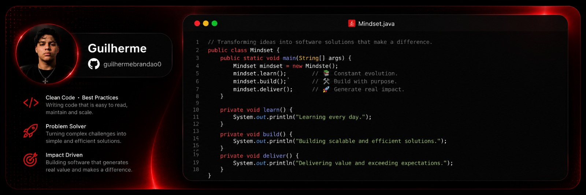

  

<h1 align="left">Hi, I'm Guilherme Brandao!</h1>

<h3 align="left"> Turning coffee into functional code.</h3>

<h4 align="left">&#127757;  I live in Brazil.</h4>

<h4 align="left">&#128233; Contact me @: <a href="mailto:brandao.dev0@gmail.com" target="_blank">brandao.dev0@gmail.com</h4>

<h4 align="left">&#128211; Currently studying Java</h4>

<h2 align="left">🌐Social media | Contact me</h2>

  

  

  

  

  

<h2 align="left">&#x1F4BB; technical skills</h2>

  

###

 

###
